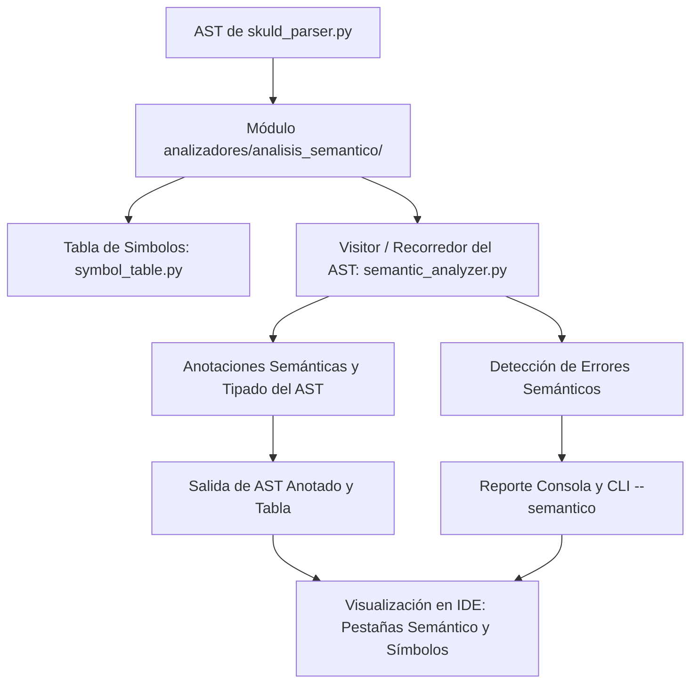

# 📑 Especificación y Plan de Desarrollo — Fase 3: Análisis Semántico

> **Universidad Autónoma de Aguascalientes**  
> **Centro de Ciencias Básicas** | Departamento de Sistemas Electrónicos  
> **Materia:** Compiladores II (9.º ISC)  
> **Docente:** Dra. Blanca Guadalupe Estrada Rentería  
> **Fechas de Entrega y Revisión:** 15 y 16 de octubre de 2026  
> **Proyecto:** Skuld Compiler & IDE  

---

## 1. 🎯 Objetivo de la Fase

Diseñar, implementar e integrar el **analizador semántico** al compilador **Skuld**, utilizando el **Árbol Sintáctico Abstracto (AST)** generado en la fase sintáctica para:
1. Aplicar las reglas semánticas del lenguaje.
2. Asignar y propagar atributos (sintetizados y heredados).
3. Construir y consultar la **Tabla de Símbolos** en tiempo real.
4. Verificar la compatibilidad y conversión de tipos.
5. Detectar y reportar errores semánticos preservando línea y columna en el IDE y CLI.

```
AST → Reglas Semánticas → Atributos → Árbol Anotado → Tabla de Símbolos → Verificación de Tipos → Detección de Errores Semánticos
```

---

## 2. 🔍 Requisitos Previos y Estado Actual del Proyecto

| Componente | Estado Actual en Skuld | Adecuación Requerida para Fase 3 |
|------------|------------------------|----------------------------------|
| **Analizador Léxico** | ✅ Completo (`skuld_lexer.py`). Reconoce tokens, conserva lexema, línea y columnas (`column_start`, `column_end`). | Reutilizar sin cambios mayores; garantizar entrega continua de tokens. |
| **Analizador Sintáctico** | ✅ Completo (`skuld_parser.py`). Construye el AST del lenguaje (declaraciones `int`, `float`, `bool`, asignaciones, `if`, `while`, `for`, I/O, etc.). | Exportar el AST base como estructura de objetos clonable/anotable. |
| **Manejo de Errores** | ✅ Errores léxicos y sintácticos en consola y con resaltado en el editor. | Añadir formato unificado `ERROR_SEMANTICO(linea, columna): <descripción> -> 'lexema'`. |
| **CLI (`skuld_compiler.py`)** | ✅ Soporta `--lexico` y `--sintactico`. | Agregar bandera `--semantico` con generación de árbol anotado y tabla de símbolos. |
| **IDE (`Skuld IDE`)** | ✅ Pestañas "Semántico", "Símbolos" y lista de errores ya previstas en la GUI. | Conectar la salida del análisis semántico para poblar la pestaña *Semántico* y la pestaña *Símbolos*. |

---

## 3. 📐 Reglas Semánticas y Atributos

En la semántica dirigida por la sintaxis (SDTS/SDD), las producciones de la gramática calculan y propagan atributos:

### 3.1 Tipos de Atributos
- **Atributos Heredados (`dtype`, `scope`):**  
  Fluyen desde los nodos superiores o del contexto hacia abajo / hermanos.
  *Ejemplo:* En la declaración de variables (`int a, b;`), el tipo de dato `int` se propaga de manera heredada hacia cada identificador de la lista.
- **Atributos Sintetizados (`type`, `val`, `is_const`):**  
  Se computan a partir de los hijos y fluyen hacia el padre.
  *Ejemplo:* En expresiones aritméticas (`a + b`), el tipo resultante se deriva de los tipos de los operandos izquierdo y derecho.

### 3.2 Construcciones de la Gramática de Skuld a Evaluar

En **Skuld** los tipos nativos del PDF equivalen a:
- `int` $\rightarrow$ `worldline`
- `float` $\rightarrow$ `divergence`
- `bool` $\rightarrow$ `reading`

Construcciones concretas:
1. **Declaraciones (`labmem`):**  
   - Sintaxis: `labmem worldline x = 5, y = 15;`  
   - Propagación heredada del tipo (`worldline`, `divergence`, `reading`) hacia la lista de identificadores declarados.  
   - Verificación de identificadores no duplicados en el mismo ámbito.
2. **Funciones (`steiner`) y Bloque Principal (`gate`):**  
   - `steiner <tipo> <nombre>(<parámetros>) { ... return <exp>; }`: ámbito local, verificación de correspondencia entre el tipo de retorno y la expresión retornada.  
   - `gate { ... }`: punto de entrada principal del programa.
3. **Asignaciones:**  
   - Sintaxis: `x = <expresión>;`  
   - Comprobación de que la variable exista en la tabla de símbolos y sea de tipo compatible con la expresión.
4. **Expresiones Aritméticas (`+`, `-`, `*`, `/`, `%`):**  
   - Compatibilidad entre tipos numéricos (`worldline` y `divergence`).  
   - Promoción implícita permitida: si se opera `worldline` con `divergence`, el resultado sintetizado es `divergence`.  
   - Error si se involucra `reading` en operaciones aritméticas.
5. **Expresiones Relacionales (`<`, `<=`, `>`, `>=`, `==`, `!=`) y Lógicas (`&&`, `||`, `!`):**  
   - Las relacionales comparan operandos compatibles y sintetizan tipo `reading`.  
   - Las lógicas exigen operandos de tipo `reading` y producen `reading`.
6. **Estructuras de Control (`choice` / `else`, `loop`, `do ... while`):**  
   - La condición obligatoriamente debe sintetizar tipo `reading`. Si se pasa una expresión numérica u otra, se emite error semántico.
7. **Sentencias de Entrada/Salida (`dmail`, `read`):**  
   - `dmail(<exp>)`: impresión en consola.  
   - Verificación de variables en lectura.

---

## 4. 🌲 Árbol Sintáctico con Anotaciones Semánticas

Se preserva el AST original y se genera un **AST Anotado** que refleja la semántica calculada:
- **Anotación de Tipo (`type`):** Calculado para cada identificador, literal y subexpresión.
- **Anotación de Valor (`val`):** Para expresiones constantes evaluables en tiempo de compilación (*constant folding* seguro sin forzar valores dinámicos de ejecución).
- **Evidencia comparativa solicitada:**
  ```
  AST Original (Sintáctico) ───► AST con Anotaciones Semánticas (Tipos, Valores constantes, Ámbito)
  ```

---

## 5. 🗃️ Tabla de Símbolos

La Tabla de Símbolos no es solo decorativa: es el componente activo de consulta e inserción del analizador semántico.

### 5.1 Información por Entrada
- **Nombre / Lexema:** Identificador único.
- **Tipo de Dato:** `int`, `float`, `bool`, etc.
- **Líneas de Aparición / Referencia:** Línea de declaración y líneas de uso.
- **Ámbito (Scope):** Nivel o bloque (global, local, bloque de control).
- **Dirección / Desplazamiento de Memoria:** Offset relativo asignado para la futura generación de código.

### 5.2 Operaciones Fundamentales
- `insert(id, type, line, ...)`: Registra identificadores al procesar declaraciones.
- `lookup(id)` / `lookup_current_scope(id)`: Busca el símbolo respetando la jerarquía de ámbitos.
- `enter_scope()` y `exit_scope()`: Manejo de bloques anidados.

---

## 6. 🔄 Verificación y Conversión de Tipos

### 6.1 Reglas de Compatibilidad y Promoción
- **Operaciones Aritméticas:**
  - `int` $\times$ `int` $\rightarrow$ `int`
  - `float` $\times$ `float` $\rightarrow$ `float`
  - `int` $\times$ `float` / `float` $\times$ `int` $\rightarrow$ `float` *(promoción implícita segura)*
  - Operaciones booleanas aritméticas: **Error Semántico**.
- **Asignaciones:**
  - `variable int = expresion int`: Válido.
  - `variable float = expresion float`: Válido.
  - `variable float = expresion int`: Válido con conversión implícita / casting implícito.
  - `variable int = expresion float`: Incompatibilidad de tipos (pérdida de precisión / asignación no permitida salvo cast explícito).
  - `variable bool = expresion int/float`: Incompatible.

---

## 7. ⚠️ Manejo de Errores Semánticos

El analizador semántico debe detectar, registrar y continuar el análisis (recuperación semántica) para los siguientes errores mínimos:

1. **Uso de variables o identificadores no declarados.**
2. **Duplicidad de identificadores o declaraciones** dentro del mismo ámbito.
3. **Incompatibilidad de tipos** en operaciones y asignaciones.
4. **Conversión de tipos no válida** (ej. asignar `bool` a `int` o `float` a `int`).
5. **Uso indebido de operadores** de acuerdo al tipo de operandos (ej. `!` sobre flotante o `+` con booleanos).
6. **Inconsistencias de tipos** en expresiones complejas.
7. **Tipo incorrecto en condiciones** de estructuras `if`, `while`, `for` (se requiere expresión booleana).

### Formato de Salida de Errores
```text
ERROR_SEMANTICO(linea, columna): <Descripción del error> -> '<lexema>'
```

---

## 8. 📦 Entregables y Criterios de Evaluación

Conforme al PDF oficial, la entrega constará de:
1. **Código fuente completo y funcional** del compilador con el módulo semántico integrado.
2. **AST original** y **AST con anotaciones semánticas** (comparables en archivo `.ast.txt` o visualizador).
3. **Tabla de símbolos generada**, detallando nombre, tipo, ámbito, referencias y memoria.
4. **Reporte / Lista de errores semánticos** con línea, columna y lexema.
5. **Pruebas de funcionamiento** sobre el archivo de código fuente del semestre y casos de prueba representativos.
6. **Documento técnico en PDF** conteniendo:
   - Explicación de la arquitectura e implementación.
   - Tabla de reglas semánticas y atributos (sintetizados / heredados).
   - Estructura y manejo de la tabla de símbolos.
   - Tabla de comprobación y conversiones de tipo.
   - Catálogo de errores semánticos detectados.
   - Capturas del IDE con el AST anotado, tabla de símbolos y lista de errores.
7. **Archivo de integrantes** con nombres completos y matrículas.

---

## 🚀 Hoja de Ruta de Implementación en Skuld


